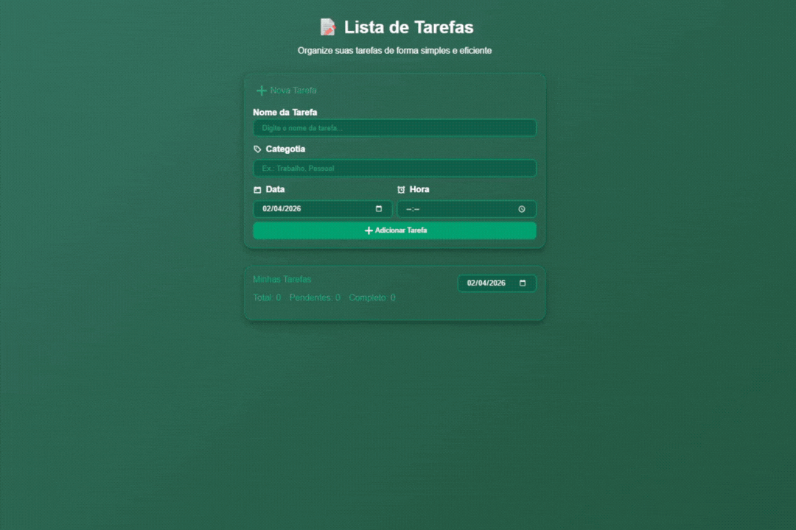

# 📝 ToDo List - JavaScript

  
  
  
  
  

---

## 🚀 Sobre o projeto

Aplicação de gerenciamento de tarefas (To-Do List) desenvolvida com foco em **organização, usabilidade e boas práticas de JavaScript moderno**.

Este projeto foi desenvolvido após a conclusão do módulo de JavaScript da Rocketseat, com o objetivo de aplicar na prática conceitos fundamentais como:

- Manipulação de DOM  
- Organização modular  
- Gerenciamento de estado  
- Interação com API (simulada com JSON Server)  

---

## 🎬 Preview da aplicação

  

## 🌐 Acesse o projeto

🔗 **Deploy:**  
https://todojsjvrb.netlify.app/

🔗 **Repositório:**  
https://github.com/jvrb/ToDo-JS

---

## ⚡ Funcionalidades

- ✅ Criar tarefas  
- 📅 Filtrar por data  
- ⏰ Ordenar por horário  
- ✏️ Editar tarefas  
- 🗑️ Remover tarefas  
- ✔️ Marcar como concluída  
- 📊 Contador de tarefas  
- 📱 Layout totalmente responsivo  

---

## 💎 Diferenciais do projeto

✔️ Estrutura modular bem definida  
✔️ Separação de responsabilidades  
✔️ Atualização dinâmica sem reload  
✔️ Código organizado e escalável  
✔️ Simulação de API com JSON Server  
✔️ JavaScript moderno (ES6+)  

---

## 🛠️ Tecnologias

  
  
  
  
  

---

## 📂 Estrutura do projeto

src/  
├── assets/ → icones da aplicação  
├── services/ → comunicação com API  
├── modules/ → regras de negócio  
├── utils/ → funções auxiliares  
└── styles/ → estilização  

---

## ⚙️ Como rodar o projeto

1. Clone o repositório  
git clone https://github.com/jvrb/ToDo-JS.git  

2. Acesse a pasta  
cd ToDo-JS  

3. Instale as dependências  
npm install  

4. Inicie a API fake  
npm run server  

5. Rode o projeto  
npm run dev  

📍 A aplicação estará disponível em:  
http://localhost:8080  

---

## 📦 Scripts disponíveis

npm run dev → inicia ambiente de desenvolvimento com live reload  
npm run server → inicia JSON Server na porta 3333  
npm run build → gera build de produção  

---

## 📄 Licença

Este projeto está sob a licença ISC.

---

## 👨‍💻 Autor

Desenvolvido por João Vitor 🚀
